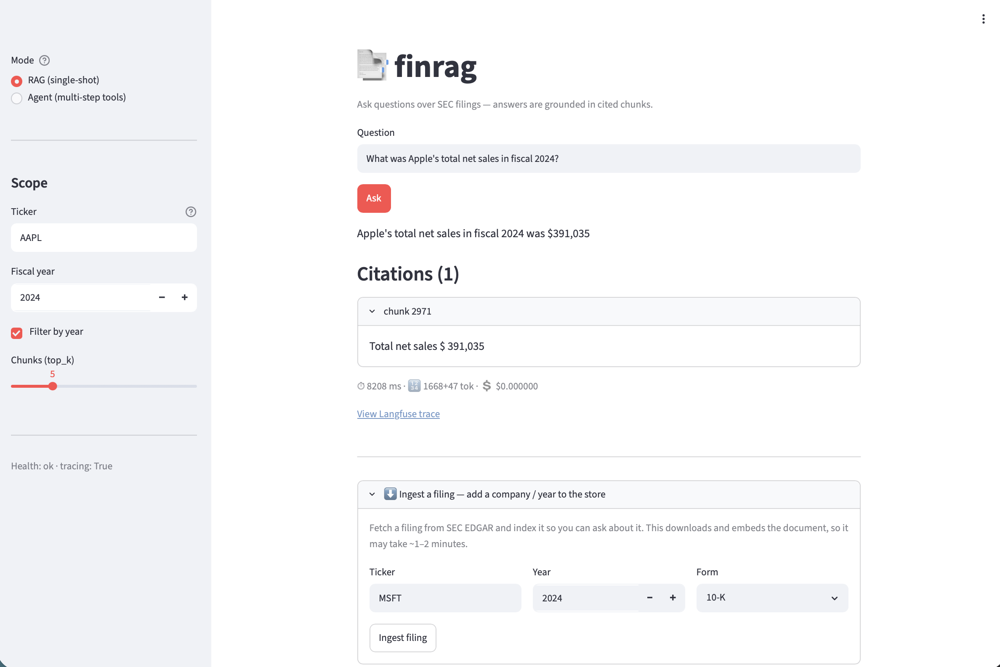
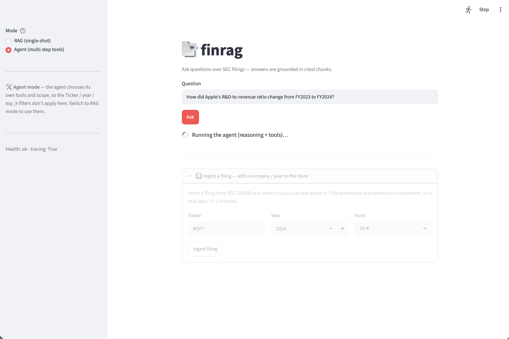
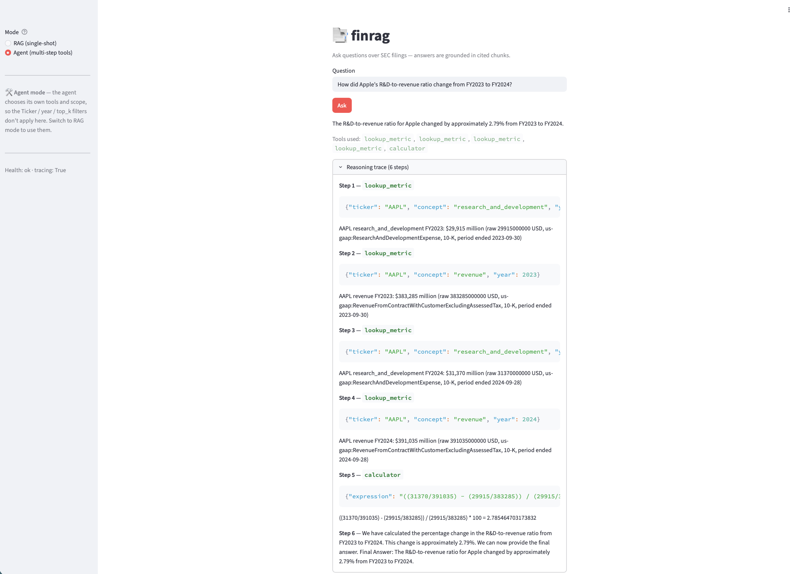

# FinRAG

[English](README.md) | [简体中文](README.zh-CN.md)

<p align="center">
  <a href="https://www.realserendipity.org/finrag/">
    
  </a>
</p>

<p align="center">
  <a href="https://www.realserendipity.org/finrag/">
    
  </a>
</p>

> ### 🔗 在线体验 → **[www.realserendipity.org/finrag](https://www.realserendipity.org/finrag/)**
> 对 Apple 10-K 提问,直接在浏览器里看到**带 citation、可追溯**的答案——无需任何安装。

## 概览

**FinRAG 是一个面向 SEC EDGAR 披露文件（10-K、10-Q、8-K、20-F、DEF 14A）的、贴近生产形态的
检索增强生成（RAG）+ Agent 系统**,用**可追溯、带 citation 的答案**回答关于美股上市公司的投研问题。
这是一个动手型 LLM 应用工程项目,从一个基于云 API 的简单 RAG baseline,逐步演进成一个经过评测、
可观测、具备 agent 能力的产品:检索实验、金融工具、公开 demo,以及 Model Context Protocol（MCP）集成。

项目亮点:

- **Eval 驱动,而非凭感觉** —— 每一次 检索 / prompt / ranker 改动都由可复现的评测 harness 验证
  （recall@k · MRR · nDCG · faithfulness · answer-relevancy,用 LLM judge）,指标 delta 提交进 git。
- **混合检索 + 重排** —— pgvector 稠密检索与 Postgres tsvector BM25 用 RRF 融合,再叠加 NVIDIA NeMo
  重排;Wave 3 消融中 recall@10 **0.72 → 0.885**。
- **带引用的结构化答案** —— pydantic 校验的答案,每条论断都指向真实 filing chunk;幻觉 citation 直接被拒,
  且每条引用的 quote 都会与被引 chunk 的原文核对(编造的 quote 返回 `verified: false`,绝不当作证据展示)。
- **手写 ReAct agent + 5 个工具** —— 从零实现的 Thought → Action → Observation 循环（无框架）,
  覆盖 filing 检索、SEC XBRL 指标查询、跨公司对比、web search、计算器,并有 LangGraph A/B。
- **MCP server（stdio + 远程 HTTP）** —— 用 Model Context Protocol 暴露 finrag 工具;既能本地 stdio 运行,
  也能作为带 bearer 鉴权、对反向代理友好的网络服务,供任意远程 MCP 客户端访问。
- **安全 guardrails + prompt 注入红队** —— 输入 / 上下文 / 输出 三层过滤（直接与间接注入、越狱、
  系统提示提取、PII、跨语言攻击）,由可复现的 attack-success-rate harness 度量:**ASR 0.29 → 0.07**。
- **可观测性与成本** —— fail-open 的 Langfuse tracing,每条回答都带每请求 token 用量与 `$/query` 估算。
- **公开 demo,纯免费档云栈** —— FastAPI（SSE）+ Streamlit,跑在纯云 API 栈上（NVIDIA NIM、
  Neon Postgres + pgvector）,无需本地模型服务,可部署在你自己的反向代理 / TLS 之后。

目标读者是开发者、分析师:从这个仓库里可以看到系统如何 ingest filing、检索证据、
校验结构化回答、度量质量,并通过 CLI、API、UI、agent tool 与 MCP 暴露完整工作流。

## Eval 驱动的结果 —— Wave 2 → Wave 3

本项目里每一次检索改动都由 eval harness 验证，而不是凭直觉。Wave 2 冻结了 baseline；
Wave 3 只改了检索管线，在 *同一套* 题目上重跑:

**评测配置** —— 两列除检索方式外完全一致:

| 配置项 | 取值 |
| --- | --- |
| 分块 | `fixed` |
| 题目数 | 38 |
| 生成模型 | `meta/llama-3.3-70b-instruct` |
| judge | `nvidia/llama-3.3-nemotron-super-49b-v1` |
| temperature | 0 |
| 检索方式 *(唯一变量)* | Wave 2 = dense · Wave 3 = hybrid RRF + cross-encoder 重排 |

| 指标 | Wave 2（dense baseline） | Wave 3（hybrid + rerank） | Δ |
| --- | --- | --- | --- |
| recall@5 | 0.66 | **0.87** | +0.21 |
| recall@10 | 0.80 | **0.97** | +0.17 |
| MRR | 0.64 | **0.80** | +0.16 |
| nDCG@10 | 0.65 | **0.84** | +0.19 |
| citation validity（结构性） | 0.82 | **0.97** | +0.15 |
| faithfulness † | 0.84 | **0.97** | +0.13 |
| answer relevancy † | 0.94 | **1.00** | +0.06 |
| correctness † | 0.84 | **0.97** | +0.13 |

检索指标（recall / MRR / nDCG）与 LLM 无关，提升完全归因于检索管线本身。† 生成类指标依赖
NVIDIA judge（Gemini 兜底），仅作方向性参考、非精确值。这些指标到此即达到平台期：
Wave 4+ 优化的是 *不同的* 维度（agent 任务成功率、延迟 / 每次查询成本、attack-success-rate），
而非单轮检索质量。Baseline：[`eval/reports/wave_2.md`](eval/reports/wave_2.md)；
最终配置：[`eval/reports/wave_3_runeval.md`](eval/reports/wave_3_runeval.md)；
逐步 ablation：[`eval/reports/wave_3{a..f}.md`](eval/reports/)。

## 路线图

| Wave | 标题                                                                                                                    | 状态    | 核心指标                                     |
| ---- | --------------------------------------------------------------------------------------------------------------------- | ----- | ---------------------------------------- |
| 0    | 基础能力（闭源 LLM dispatch、项目脚手架）                                                                                           | ✅ 已交付 | —                                        |
| 1a   | Postgres + pgvector schema + NVIDIA embedding provider                                                                | ✅ 已交付 | schema migration 幂等；`embed()` 返回 1024d 向量 |
| 1b   | 基于本地 fixture 的 dense retrieval + cited answer（pydantic）                                                               | ✅ 已交付 | 带有效 citations 的结构化 `Answer`              |
| 1c   | EDGAR ingestion + CLI driver                                                                                          | ✅ 已交付 | `finrag ingest` + `finrag ask` 端到端       |
| 1d   | NVIDIA NIM 作为 cloud open-weight provider                                                                              | ✅ 已交付 | `LLM_PROVIDER=nvidia` round-trip         |
| 1.5  | Mini-eval 跑在真实 AAPL FY2024 10-K 上（n=7,6 正例 + 1 insufficient）+ prompt `v1.1`（insufficient-context 用 JSON 返回） | ✅ 已交付 | hit@5 / recall@5 / MRR / nDCG@5 / 结构性 citation validity / LLM-judge faithfulness,数字见 [`eval/reports/wave1_5_mini_eval.md`](eval/reports/wave1_5_mini_eval.md) |
| 2    | Eval harness（38 条 curated items × 5 类,NIM judge + Gemini 兜底）                                                       | ✅ 已交付 | recall@10 0.80 / MRR 0.64 / nDCG@10 0.65 / citation validity 0.82 / faithfulness 0.84 / correctness 0.84,详见 [`eval/reports/wave_2.md`](eval/reports/wave_2.md) |
| 3    | Retrieval quality（chunking / table-aware / hybrid / rerank / query rewrite）                                           | ✅ 已交付 | recall@10 0.72 → **0.885**（hybrid + rerank），见下方[消融表](#wave-3-检索消融) |
| 4    | 手写 ReAct agent + 5 个工具，然后用 LangGraph 重写                                                                              | ✅ 已交付 | task success **0.94**（17/18）· tool-call accuracy 1.00 · 平均 3.0 步 —— [`eval/reports/wave_4.md`](eval/reports/wave_4.md)，A/B 见 [`wave_4_langgraph_compare.md`](eval/reports/wave_4_langgraph_compare.md) |
| 5A   | Public demo（FastAPI + Streamlit）                                                                                      | ✅ 已交付 | 4 条路由经 HTTP 跑通；SSE 答案 + citation UI；p50 ≈ 12.6s —— [`eval/reports/wave_5a.md`](eval/reports/wave_5a.md) |
| 5B   | Observability、cost、caching                                                                                            | ✅ 已交付 | Langfuse spans（fail-open）· 每请求 token + `$/query`（NVIDIA 免费档 $0）—— [`eval/reports/wave_5b.md`](eval/reports/wave_5b.md) |
| 6    | Security & protocols（prompt-injection red team、output guardrails、MCP server）                                          | ✅ 已交付 | attack-success-rate **0.29 → 0.07**（间接注入 0.67 → 0.00）；finrag 作为 MCP server 暴露 —— [`eval/reports/wave_6.md`](eval/reports/wave_6.md) |
| 7    | Extensions & framework comparisons（LlamaIndex / DSPy / CrewAI / Cloudflare edge / CN A-share / memory / self-correct） | ⏳     | 每项对应 resume bullet                       |

### Wave 3 检索消融

每一步都是在 38 条 eval 上的 A/B(检索指标与 LLM 无关,直接从 `retrieve()` 输出度量)。完整方法与分类表见 `eval/reports/wave_3{a..f}.md`,每个 `experiments/wave3_*.py` 可复现对应行。

| 步骤 | 改动 | 结果(对各自 baseline) | 是否上线 |
| ---- | ---- | --------------------- | -------- |
| 3a | 分块:fixed vs sentence-window vs parent-doc | recall@10 **fixed 0.722** > parent_doc 0.515 > sentence_window 0.247 | fixed(语义切分会切碎表格) |
| 3b | table-aware 入库(Docling) | numeric+table recall@10 0.738→0.671,**MRR +0.042** | 否 —— SEC HTML 抽取有损,混合结果 |
| 3c | hybrid pgvector + tsvector RRF | recall@10 0.722→**0.753**(+0.031),MRR +0.038 | ✅ `RETRIEVAL_MODE=hybrid` |
| 3d | cross-encoder 重排(top-50→10) | recall@10 0.753→**0.885**,MRR 0.681→0.801,nDCG→0.798 | ✅ `RERANK_ENABLED=1`(最大增益) |
| 3e | query rewriting(欠定查询) | HyDE recall@10 0.622→**0.676**(+0.054);multi-query −0.017 | 可配 `QUERY_REWRITE=multi_query\|hyde`;默认 `none` |
| 3f | embedding:NVIDIA vs Gemini | Gemini recall@10 0.722→**0.788**(+0.066),MRR +0.190 —— 但 3× 维度/成本 | 否 —— 保留与索引匹配的 1024d NVIDIA |

**上线默认:fixed 分块 + hybrid RRF + 重排** → recall@10 **0.722 → 0.885**,MRR **0.643 → 0.801**,nDCG@10 **0.610 → 0.798**(dense baseline → 最终配置;reranker 用 `nvidia/rerank-qa-mistral-4b`,即账号上实际可用、替代计划里 `-v3` 的变体)。

**为什么 `QUERY_REWRITE` 默认 `none`(3e):** 相对原始基线,HyDE 是用 top 排序精度(MRR −0.038 / nDCG −0.035 / recall@5 −0.047)换召回覆盖(recall@10 +0.054 / hit@5 +0.083 / hit@10 +0.055),multi-query 基本持平——都不是干净的提升。而且上线路径保留了 ticker/period 元数据过滤,本就已消解 rewriting 想解决的模糊查询,且每次改写都要多调一次 LLM。所以默认关、但保留为按次开关。完整逐指标对比与"欠定查询"测试设定见:[`eval/reports/wave_3e.md`](eval/reports/wave_3e.md)。

## Wave 4 —— ReAct agent + 工具

一个手写的 ReAct 循环（[`src/agent.py`](src/agent.py)）—— Thought → Action →
Observation，不依赖任何 agent 框架 —— 调度五个工具:

| 工具 | 来源 | 用途 |
| ---- | ---- | --- |
| `retrieve_filing` | Wave 3 的 hybrid + rerank 检索器 | 已入库 filing 里的叙事 / 定性事实 |
| `lookup_metric` | SEC XBRL `companyconcept` API | 单个审计过的年度数值（不走 RAG） |
| `compare_companies` | SEC XBRL | 多家公司同一指标并排对比（省略 `year` 时取最近的**共同**财年） |
| `calculator` | AST 求值（不用 `eval`） | 比率、百分比变化、求和 |
| `web_search` | Tavily（可选） | 语料库之外的事实 |

刻意的分工:**数值问题走结构化 XBRL,不走切碎的 prose**。每次运行都会把可回放的
JSONL trace 写到 `runs/<id>.jsonl`;agent 还带最简 session memory(最近 N 轮 Q/A)。
在 18 题多步任务套件([`eval/agent_questions.jsonl`](eval/agent_questions.jsonl))上:

| 指标 | 结果 |
| ---- | ---- |
| task success（LLM-judge 正确性） | **0.94**（17/18;唯一一次 miss 是 ground-truth 数字过期,不是 agent 出错） |
| tool-call accuracy | **1.00** |
| 平均步数 / 任务 | **3.0**（目标 ≤ 6） |

同一个循环又用 LangGraph 重写了一遍([`src/agent_lg.py`](src/agent_lg.py)),即一个两节点的
`StateGraph`;两者产生相同的工具序列 —— A/B 见
[`eval/reports/wave_4_langgraph_compare.md`](eval/reports/wave_4_langgraph_compare.md)。
运行方式:`uv run python -m src.agent "..."` 或 `uv run python eval/run_eval.py --suite agent`。

> **设计取舍 —— 为什么用文本式 ReAct 而非 native tool-calling:** 本 wave 刻意手写文本式
> 循环(终止信号是模型输出 `Final Answer:`,而非 API 的 `tool_calls` 字段),目的是让循环、
> 停止条件、解析、容错都摆在明面上。代价是依赖模型可靠遵守格式(已用单参数兜底 / lookahead /
> `\nObservation:` 截断做容错);好处是**只要"文本进文本出"就行,换 provider 零改代码**
> —— 已实测同一份 agent 在 NVIDIA 与 Gemini 上均跑通。native tool-calling 由 API 保证结构化、
> 生产更稳但与 provider 绑定;三方对照(文本式 / LangGraph / native 函数调用)留到
> `execution.md` **7.fc** 做(见该子项)。

## 技术栈（只使用云 API，不依赖本地服务）

| Layer | Primary | Options |
|---|---|---|
| LLM — 生成 | **NVIDIA NIM** `meta/llama-3.3-70b-instruct`（免费开源权重） | Gemini、Anthropic Claude、OpenAI |
| LLM — judge（eval） | **NVIDIA NIM** `nvidia/llama-3.3-nemotron-super-49b-v1`（推理微调，≥ 生成模型） | Gemini |
| Embedding | NVIDIA NeMo Retriever `nvidia/nv-embedqa-e5-v5`（1024d） | Gemini `gemini-embedding-001` |
| Reranker | NVIDIA NeMo Retriever `nvidia/rerank-qa-mistral-4b` | — |
| Vector + lexical store | **Neon Postgres + pgvector + tsvector FTS** | — |
| Agent | hand-written ReAct + LangGraph 重写（Wave 4） | — |
| Eval | 手写指标（recall@k / MRR / nDCG + LLM judge） | — |
| Tracing | Langfuse Cloud | — |
| Output validation | pydantic | — |
| Guardrails（Wave 6） | 确定性 注入 / PII / 输出 过滤 + NVIDIA NemoGuard content-safety | OpenAI Moderation |
| MCP（Wave 6） | official `mcp` Python SDK —— stdio + streamable HTTP server | — |
| API / UI | FastAPI（SSE）+ Streamlit | — |
| Deployment | Docker / compose（任意 VPS 或免费 PaaS）；用你自己的反向代理 / TLS 暴露 | — |

Provider 切换由环境变量控制：`LLM_PROVIDER`、`LLM_JUDGE_PROVIDER`、`EMBEDDING_PROVIDER`、
`RERANKER_PROVIDER`,使用单文件 `if/elif` dispatch。生成与 judge 的主用 provider 都是 NVIDIA NIM,
Gemini / Anthropic / OpenAI 仅作可选项。judge 使用比生成模型更强的模型
(`nemotron-super-49b` 推理微调,≥ `llama-3.3-70b` 生成模型)并在 temperature=0 下运行以保证评审可信。
模型选择是 eval 驱动的:`llama-4-maverick` 作生成被淘汰(在难数值题上过度推理、破坏严格 JSON 答案契约);
`deepseek-v4-pro` 虽更强但免费额度 429 限流过紧,无法支撑整轮 eval。

## 快速开始

```bash
uv sync --group dev
cp .env.example .env
# 填写 GEMINI_API_KEY + DATABASE_URL + NVIDIA_API_KEY

# 跑测试
uv run pytest

# 入库一份 filing 并提问（Wave 1c）
uv run finrag ingest --tickers AAPL --year 2024
uv run finrag ask --ticker AAPL --year 2024 "What was Apple's R&D expense?"
```

### Web demo（Wave 5A / 5B）

> **在线访问：** [www.realserendipity.org/finrag](https://www.realserendipity.org/finrag/) —— 就是下面这个 Streamlit UI，后台保持私有（UI 是唯一对外入口）。

**最快 —— 一个容器同时跑 API 和 UI：**

```bash
cp .env.example .env          # 填 DATABASE_URL + NVIDIA_API_KEY
docker compose up --build     # 然后打开 http://localhost:8501
```

UI 带一个 **RAG / Agent 模式开关**（单轮带引用答案 vs 多步调用工具的 agent），
以及一个**入库面板**，可以把新的 filing 拉进库里。

| Agent 模式 —— 运行中 | Agent 模式 —— 多步工具调用轨迹 |
| :---: | :---: |
|  |  |

*Agent 模式回答多步问题（"Apple 的 R&D / 营收比从 FY2023 到 FY2024 如何变化？"）：
ReAct 循环对两个年度分别调 `lookup_metric`（SEC XBRL）取 R&D 和营收，再调
`calculator`，并展示完整的推理轨迹。*

或者开发时分别起两个服务：

```bash
# 终端 1 —— API。文档：http://127.0.0.1:8000/docs
uv run uvicorn src.api:app --host 0.0.0.0 --port 8000

# 终端 2 —— Streamlit UI（通过 FINRAG_API_URL 调上面的 API，默认 :8000）
uv run streamlit run src/ui.py
```

```bash
# 或直接打 API
curl http://127.0.0.1:8000/health
curl -N -X POST http://127.0.0.1:8000/ask -H 'Content-Type: application/json' \
  -d '{"question":"What was Apple total net sales in fiscal 2024?","ticker":"AAPL","year":2024}'
```

路由：`GET /health`、`POST /ask`（SSE：status → answer → done，带心跳 ping，
代理不会掐断长请求）、`POST /agent`（ReAct，JSON）、`POST /ingest`（立即返回
**202 + job_id**——ingest 要跑数分钟，远超代理超时——用 `GET /ingest/{job_id}`
轮询状态/结果）。每个 `/ask` 和 `/agent` 响应都带延迟、token 用量、
按每次调用**实际使用的模型**计价的 `$/query` 估算（价格表中没有的模型会标记
`cost_estimated: false`），并在设置了 `LANGFUSE_*` 时带一个 `trace_url`——其 trace
嵌套了 retrieve / llm / tool 各 span（fail-open：tracing 不会拖垮请求）。
意外失败返回稳定的 `internal_error` 错误码——异常细节只留在服务端日志里。

**鉴权与部署（域名无关）。** 设 `API_TOKEN` 即可让 `/ask /agent /ingest`
（含 `/ingest/{job_id}`）需要 `Authorization: Bearer <token>`（`/health` 保持开放）；设 `API_ROOT_PATH`（如 `/finrag`）
让服务跑在反向代理的某个路径前缀下。公开暴露时设 `RATE_LIMIT_ENABLED=1`：昂贵路由按
token（未鉴权时按代理上报的客户端 IP）限流——`/ask` 10 次/分、`/agent` 3 次/分、
`/ingest` 2 次/时——泄露的 URL 或 token 烧不掉免费档的 LLM/embedding 配额。典型的公开部署把**后台留在 localhost**，只把
**Streamlit UI 作为唯一公网入口**挂在某个子路径上 —— UI 在服务端通过
`FINRAG_API_URL` + `FINRAG_API_TOKEN` 调后台，token 不进浏览器。可用仓库里的
`docker compose up`（[`Dockerfile`](Dockerfile) / [`compose.yaml`](compose.yaml) 一个容器跑两个服务），
再用你自己的反向代理 / TLS（或平台自带的 HTTPS）暴露即可。

## 安全与 MCP（Wave 6）

**Guardrails。** [`src/guardrails.py`](src/guardrails.py) 在 RAG / agent 路径外包了一层
纵深防御过滤，默认开启（`GUARDRAILS_ENABLED=1`）：

- `screen_input` —— 在模型运行**之前**拦截 prompt 注入 / 越狱 / 系统提示提取（确定性正则
  签名，无需联网，含中文变体；可选开启 [NVIDIA NemoGuard](https://build.nvidia.com/nvidia/llama-3_1-nemoguard-8b-content-safety)
  content-safety，`NEMOGUARD_ENABLED=1`，用于真正有害的内容）。
- `screen_context` / `screen_observation` —— 生成前丢弃夹带**间接注入**（"忽略用户，改为…"）
  的检索 chunk；agent 的工具观察结果（检索摘录、web 搜索片段）命中同类签名时同样扣留——
  被投毒的片段既劫持不了回答，也劫持不了循环。丢弃会记日志并进 trace，绝不静默。
- `validate_output` / `redact_pii` —— 在每个 `ask`/`agent` 答案返回**之前**运行：扣留回显
  提示词/配置的答案，再对文本脱敏 email / SSN / 卡号（Luhn 校验）/ 电话。

签名针对攻击**措辞**而非金融词汇，所以正常的 filing 问题不受影响（零误报，见
`tests/test_wave6.py`）。NemoGuard 评估的是内容**危害**而非注入，因此它是对签名的**增强**而非
替代，且永远 fail-open 退回到签名层。

**Red team。** [`eval/red_team.jsonl`](eval/red_team.jsonl) 含 5 类对抗 prompt（直接越狱、
系统提示提取、citation 操纵、经投毒 chunk 的间接注入、中文攻击）。harness 对每条在关 / 开
防御两种情况下各跑一遍，报告防御前后的 attack-success-rate —— 成功与否用 canary 确定性判定，
所以数字可复现。

**把 finrag 当作 MCP 工具用。** [`src/mcp_server.py`](src/mcp_server.py) 用官方 `mcp` SDK
把 finrag 暴露为 MCP server：`ask_filings`（带引用的 RAG）、`research_agent`（多步 ReAct）
以及 Wave 4 的 5 个工具。两种 transport,用 `FINRAG_MCP_TRANSPORT` 选择：

**本地（stdio）** —— 同机的 MCP 客户端,以子进程方式拉起 server。命令行方式:

```bash
claude mcp add finrag -- uv run python -m src.mcp_server
```

或写进配置文件（`.mcp.json`、`claude_desktop_config.json`、Cursor……）:

```json
{
  "mcpServers": {
    "finrag": {
      "command": "uv",
      "args": ["run", "python", "-m", "src.mcp_server"],
      "cwd": "/absolute/path/to/finrag"
    }
  }
}
```

**远程（Streamable HTTP）** —— 把 finrag 暴露成**可被远程 MCP 客户端访问的网络服务**。
它无状态运行(对反向代理 / tunnel 友好),并要求 `Authorization: Bearer <MCP_TOKEN>`。
绑定到 localhost,再用你的反向代理 / tunnel（TLS + 同一个 `MCP_TOKEN`）暴露,和 web demo 一样:

```bash
MCP_TOKEN=your-secret FINRAG_MCP_TRANSPORT=http uv run python -m src.mcp_server
# → 在 http://127.0.0.1:8200/mcp 提供 Streamable HTTP 服务
```

然后让任意支持 HTTP 的 MCP 客户端用 bearer 头连接公网 `/mcp` URL。命令行方式:

```bash
claude mcp add --transport http finrag https://your-domain/mcp \
  --header "Authorization: Bearer your-secret"
```

或写进配置文件（`.mcp.json`、Cursor、VS Code……）:

```json
{
  "mcpServers": {
    "finrag": {
      "type": "http",
      "url": "https://your-domain/mcp",
      "headers": { "Authorization": "Bearer your-secret" }
    }
  }
}
```

同一套护栏覆盖整个 MCP 面：`ask_filings` / `research_agent` 从 RAG/agent 路径继承防御；
直接暴露的 Wave 4 工具会先筛查字符串入参，再像 agent observation 一样筛查输出
（投毒的摘录会被扣留，而不是返回给客户端）。对外暴露时请把
`FINRAG_MCP_ALLOWED_HOSTS`（host 白名单）和 `MCP_TOKEN`（bearer 鉴权）一起设置——
在代理 TLS 之上再加一层纵深防御。

### 实际使用验收

```bash
# 1) 红队：跑出 ASR before/after，落到 eval/reports/wave_6.md（+ 时间戳原始 run）
LANGFUSE_PUBLIC_KEY= LANGFUSE_SECRET_KEY= uv run python -u eval/run_red_team.py
#    → SUMMARY {"asr_before": ~0.29, "asr_after": ~0.07}

# 2) MCP server：用官方 inspector 验证 tools/list（需要 npx）
npx @modelcontextprotocol/inspector --cli uv run python -m src.mcp_server --method tools/list
#    → 打印含 7 个工具的 JSON（ask_filings、research_agent + Wave 4 的 5 个工具）
#    去掉 --cli/--method 则启动浏览器 UI，可交互调用工具

# 3) 用上面的配置把 server 接入任意 MCP 客户端,问 "What was AAPL revenue in FY2024?"
#    → 经 finrag 的 ask_filings 返回带 citation 的答案

# 4) 防御对普通问题零误报 + 拦截攻击（离线,无需 key）
uv run python -m pytest tests/test_wave6.py -q     # guardrails + MCP 测试全过
```

防御默认开启,所以 `finrag ask` / `/agent` / MCP 在实际使用中已被保护：对注入 prompt 直接返回
固定拒答（`GUARDRAILS_ENABLED=0` 可关闭以测无防御 baseline）。

## 分块策略(可配置）

分块策略在 ingest 时可配：用 `--chunk-strategy` 或环境变量 `CHUNK_STRATEGY` 选择(默认 `fixed`)。
它只影响 filing 在 embedding 前如何切分,检索与回答逻辑不变。非法值会**立即报错**(在任何 EDGAR 抓取 / embedding 之前)。

```bash
# 方式一:用 CLI flag 按次指定
uv run finrag ingest --tickers AAPL --year 2024 --chunk-strategy section

# 方式二:在 .env 里设默认值(CHUNK_STRATEGY=section)后正常运行
uv run finrag ingest --tickers AAPL --year 2024
```

| 策略 | 做什么 |
| --- | --- |
| `fixed`(默认) | 段落打包的 token 窗口(约 300 cl100k token;超长段落按重叠切分) |
| `sentence_window` | N 句的重叠窗口,保持句子完整 |
| `section` | 按 10-K 结构标题(Item / Part)切,并给每个 chunk 前缀所在节标题 |
| `parent_doc` | embedding 小 child 用于精确检索,大 parent 块存进 metadata;`ask()` 把 parent 作为上下文喂给 LLM |

在 AAPL 10-K 这套 eval 语料上 `fixed` 胜出 —— 语料小且数值/表格密集,更细的分块会抬高 recall 分母(见 [`eval/reports/wave_3a.md`](eval/reports/wave_3a.md) 与 [`wave_3g.md`](eval/reports/wave_3g.md))。其余策略保留,因为最优策略取决于语料;换语料时切换并重新测量即可。

### 新增一种分块策略

策略名只有一个事实源(`src/ingest.py` 的 `VALID_CHUNK_STRATEGIES`),所以新增是一处小的局部改动:

1. 在 `src/ingest.py` 写一个 `chunk_<name>(text, ...) -> list[str]`(若需要 parent 上下文则 `-> list[(child, parent)]`)。
2. 把 `"<name>"` 加进 `VALID_CHUNK_STRATEGIES`,并在 `build_chunks()` 加一个分支,返回 `list[(content, metadata)]` —— 生成时要用的上下文(如 parent 块)放进 `metadata` dict。
3. 若用了 `metadata["parent_text"]`,生成端已经会优先使用(`rag._context_text`),无需再接。
4. `CHUNK_STRATEGY` 环境变量、`--chunk-strategy` flag、fail-fast 校验都会自动从 `VALID_CHUNK_STRATEGIES` 识别这个新名字。
5. 在 `tests/test_wave3.py` 加单测,并用 `experiments/wave3_*.py` 脚本对 `eval/run_eval.py` 做 A/B。

## 目录结构

```text
src/
  cli.py             # finrag ask / ingest 入口
  config.py          # 基于环境变量的 provider / model 配置
  llm.py             # LLM provider 分发（Gemini / Anthropic / OpenAI / NVIDIA）
  embed.py           # embedding 分发（NVIDIA 主用，Gemini 用于 Wave 3f）
  rerank.py          # reranker 分发（NVIDIA NeMo Retriever）
  db.py              # Postgres 连接池 + schema 引导
  ingest.py          # parse -> chunk（fixed / sentence-window / section / parent-doc）-> embed -> upsert
  retrieve.py        # vector / FTS / hybrid (RRF) / rerank 检索
  query_rewrite.py   # normalize / multi-query / HyDE（Wave 3e）
  rag.py             # retrieve -> prompt -> Answer (pydantic)
  agent.py           # 手写 ReAct 循环 + session memory，JSONL trace（Wave 4）
  agent_lg.py        # 同一个循环用 LangGraph 重写（Wave 4 A/B）
  api.py             # FastAPI：/health /ask（SSE）/agent /ingest（Wave 5A）
  ui.py              # Streamlit 单页 Q&A，走 /ask（Wave 5A）
  obs.py             # fail-open Langfuse tracing + 每请求 token 计量（Wave 5B）
  cost.py            # token → USD 估算（Wave 5B）
  guardrails.py      # 注入 / PII / 输出 过滤 + NemoGuard            （Wave 6）
  mcp_server.py      # 将 finrag 工具暴露为 MCP server —— stdio + 远程 HTTP（Wave 6）
  clients/           # 各 provider 的轻量 HTTP 客户端
    _http.py
    anthropic.py
    gemini.py
    openai.py
    nvidia.py
    edgar.py
  financial/         # EDGAR 抓取 + pydantic schema + 表格抽取
    edgar.py
    schemas.py
    table_extract.py # Docling 表格感知抽取（Wave 3b）
  tools/             # agent 工具（Wave 4）：spec + registry，一个 concern 一个文件
    spec.py          #   Tool 数据类（共享，避免循环 import）
    calculator.py    #   安全算术（AST，不用 eval）
    retrieve_filing.py #  对已入库 filing 文本做语义检索
    xbrl.py          #   lookup_metric + compare_companies，走 SEC XBRL
    web_search.py    #   Tavily 网页搜索（可选；需 TAVILY_API_KEY）
prompts/             # 版本化 prompt 文件（answer_v*、react_v1）
sql/                 # schema 迁移（001_init.sql）
data/                # raw / processed / fixtures
eval/                # 评测问题集、agent 套件、red-team 集 + run_red_team、指标、报告
experiments/         # 消融脚本
docs/                # README 资源（demo 截图、badge）
runs/                # agent 运行 trace，每次一份 JSONL（gitignored）
tests/               # pytest 用例（含 test_wave6：guardrails + MCP）
Dockerfile           # 一个镜像同时跑两个服务（API + Streamlit UI）（Wave 5A）
compose.yaml         # `docker compose up` → UI 在 :8501；API 留在容器内
deploy/entrypoint.sh # 容器内同时拉起 API + UI
.env.example
pyproject.toml
execution.md
README.md
README.zh-CN.md
```

## License

个人学习 / 作品集项目；不是生产软件。
